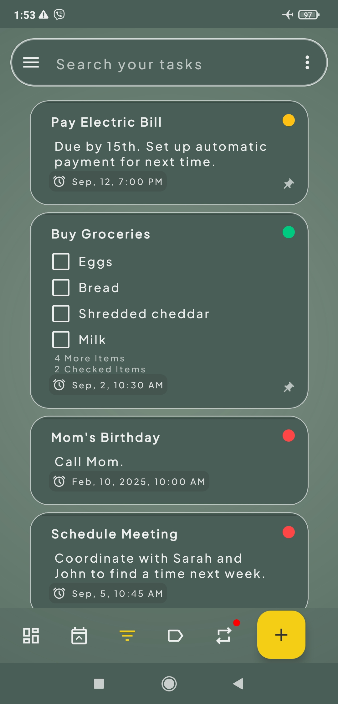
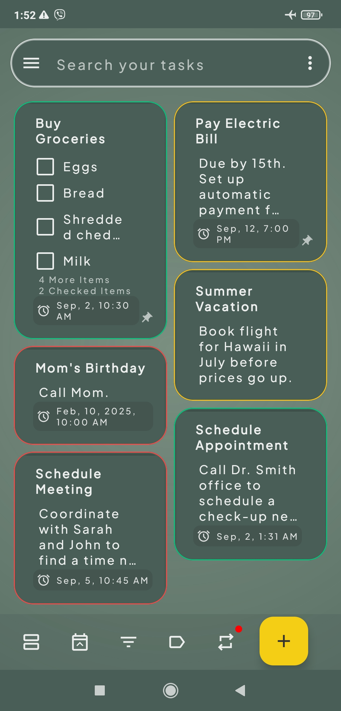
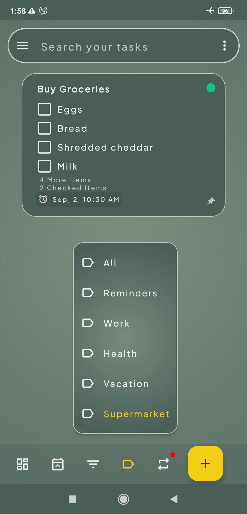
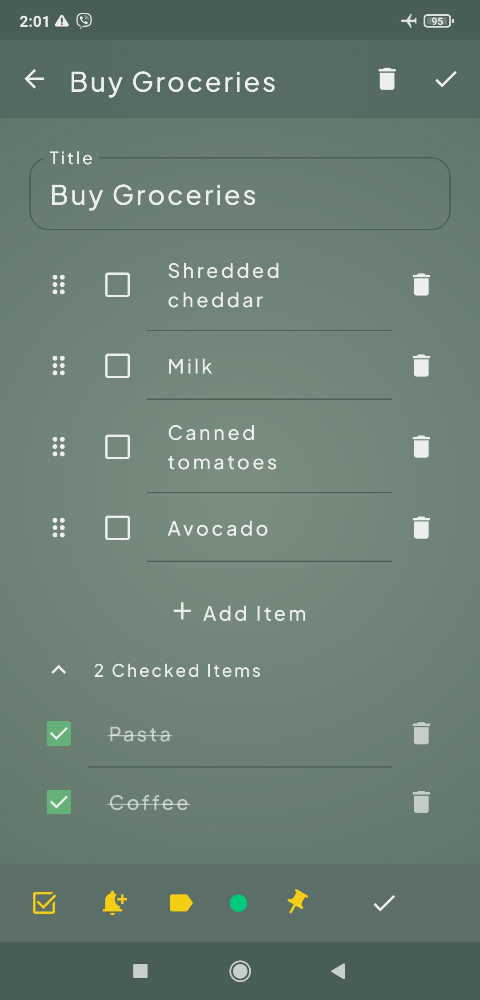

# dueToDo - A To-Do List App

dueToDo is a to-do list application designed to assist users in managing their tasks effectively. \
The application offers a user-friendly and intuitive interface for creating tasks, setting reminders, categorizing, and prioritizing tasks. \
New features and enhancements are continually being added to further improve user experience and functionality.

### Current Features

*   Task creation, editing, and deletion
*   Checklists for task management
*   Task prioritization for efficient task handling
*   Task organization into categories for better clarity
*   Task search functionality
*   Task sorting by category and priority
*   Linear and Grid layout options
*   Due date setting for tasks
*   Notify of overdue tasks for better task management
*   Notifications to keep users updated

### Planned Enhancements

*   Rescheduling and repeating of task due dates
*   User Interface design for notifications
*   'Notify Later' functionality for notifications
*   Refinement of Dark Theme

## Technologies Used

*   Kotlin
*   Jetpack Compose
*   Room Database
*   MVVM Architecture
*   DataStore Preferences
*   Dagger/Hilt
*   Worker Manager
*   Material Design

## How to Run

1.  Clone the repository
2.  Open the project in Android Studio
3.  Build and run the app on an emulator or device

   ## Screenshots

| Main Screen (Grid Layout)                                                                      | Filter By Category                                                                         |
| :--------------------------------------------------------------------------------------------- | :----------------------------------------------------------------------------------------- |
|                                   |                           |

&nbsp;

| Checklist Task                                                                               | Task Search                                                                              |
| :------------------------------------------------------------------------------------------- | :--------------------------------------------------------------------------------------- |
|                                 |                                     |

&nbsp;

| Overdue Tasks                                                                                  | Create New Category                                                                        |
| :--------------------------------------------------------------------------------------------- | :----------------------------------------------------------------------------------------- |
|                                    |                              |

