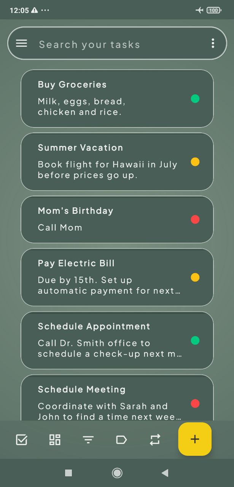
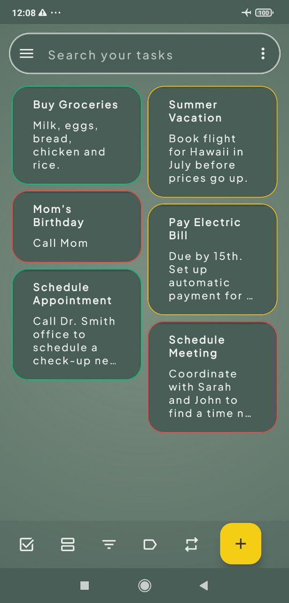
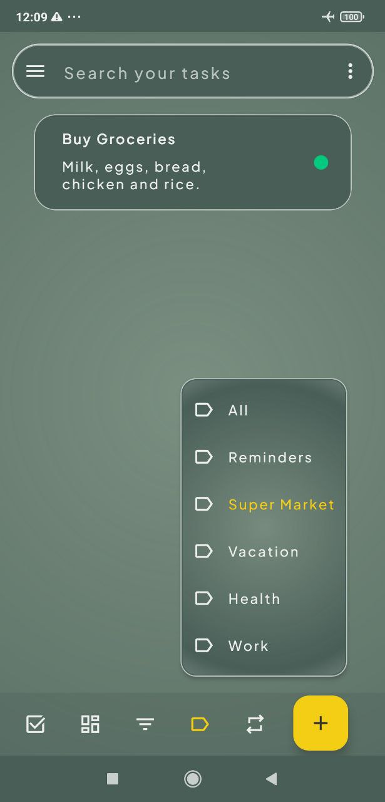
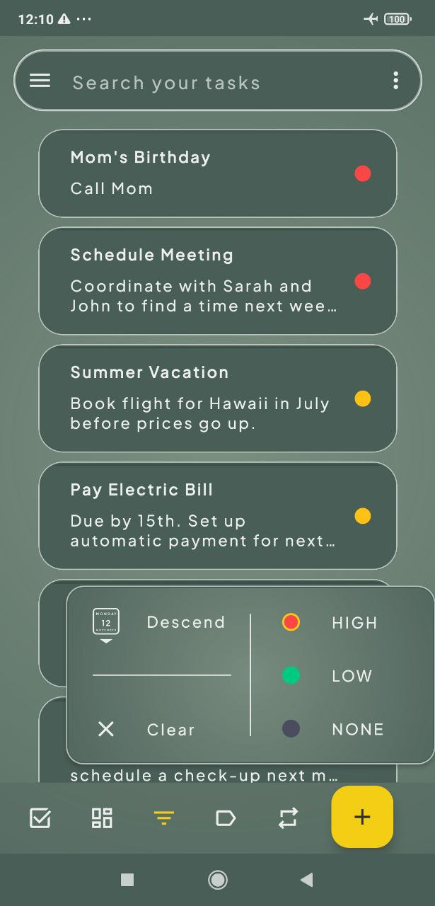
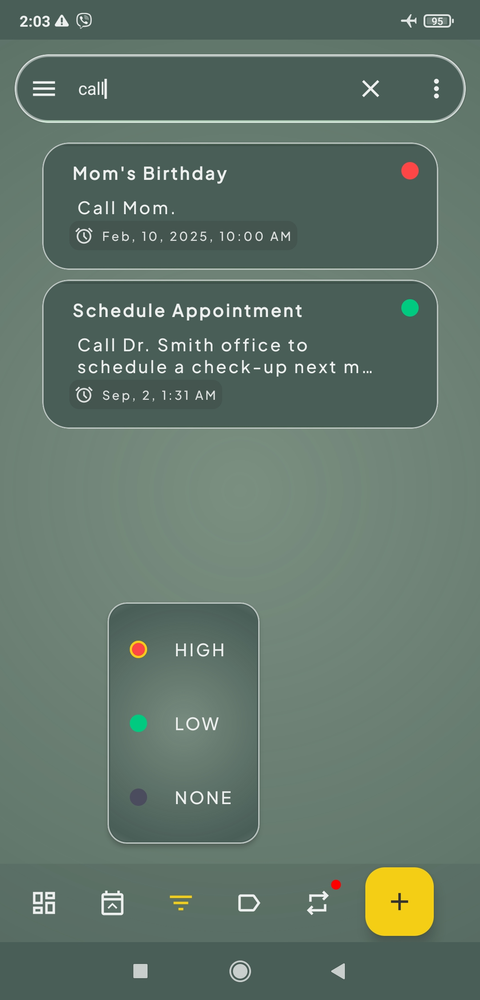
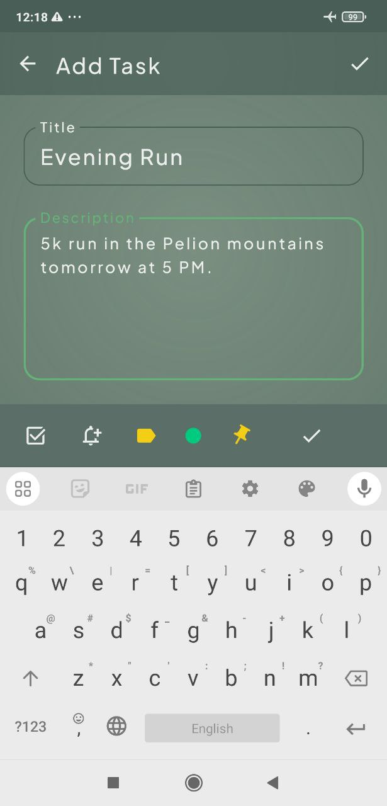
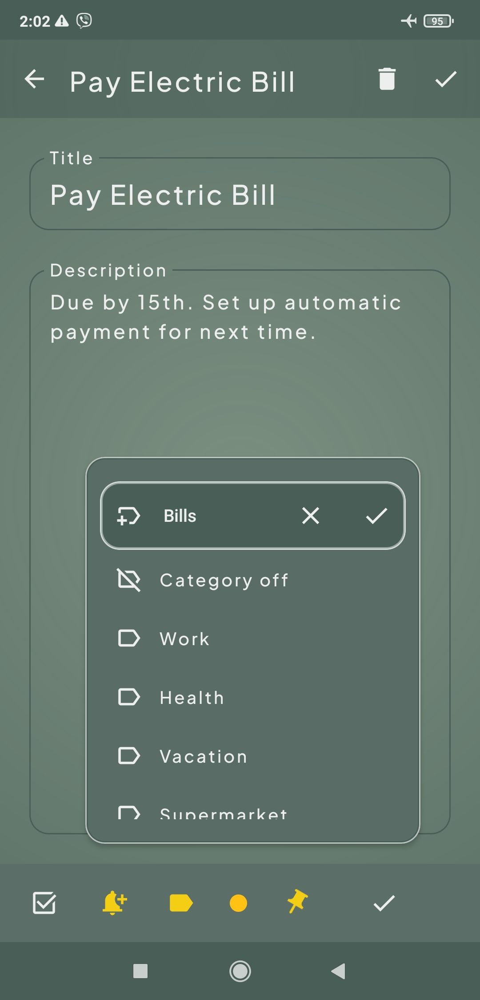

# dueToDo - A To-Do List App (Under Development)

dueToDo is a to-do list app designed to help users manage their tasks effectively. \
It's currently under active development, with new features being added regularly. \
The app aims to provide a user-friendly and intuitive experience for organizing, set reminders and prioritizing tasks.

### Current Features

*   Create, edit and delete tasks
*   Task prioritization
*   Organize tasks into categories
*   Search Tasks
*   Sort tasks by category, date and priority.
*   Linear and Grid layouts
*   Set due dates

### Planned Enhancements

*   Checklists
*   Set reschedule dates (currently working on)
*   Reminders and notifications (currently working on)
*   Display overdue tasks
*   User authentication
*   Import/export database
*   Customizable themes

## Technologies Used

*   Kotlin
*   Jetpack Compose
*   Room Database
*   MVVM Architecture
*   DataStore Preferences
*   Dagger/Hilt
*   Worker Manager
*   Material Design

## How to Run

1.  Clone the repository
2.  Open the project in Android Studio
3.  Build and run the app on an emulator or device

   ## Screenshots

| Main Screen (Grid Layout)                                                                           | Category Selection                                                                         |
| :--------------------------------------------------------------------------------------------- | :----------------------------------------------------------------------------------------- |
|                                           |                               |

&nbsp;

| Sorting Options                                                                               | Task Search                                                                             |
| :------------------------------------------------------------------------------------------- | :--------------------------------------------------------------------------------------- |
|                                               |                                         |

&nbsp;

| New Task Creation                                                                             | Create New Category                                                                   |
| :--------------------------------------------------------------------------------------------- | :----------------------------------------------------------------------------------------- |
|                                           |                               |

